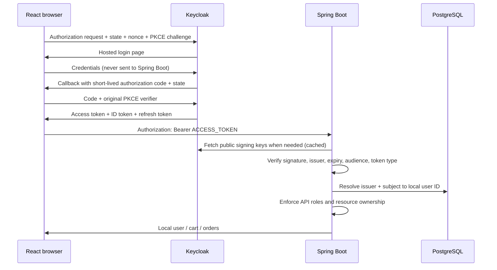

# Learn and demonstrate OIDC with Sujus Pickle

## What was implemented, and where

| Location | Responsibility |
| --- | --- |
| `compose.yaml`, `dev/keycloak/sujus-pickle-realm.json` | Start the local Keycloak identity provider and configure its clients, roles, PKCE and demo accounts |
| `src/main/resources/application-oidc.yaml` | Select the trusted issuer, public-key endpoint and API audience |
| `security/oidc/OidcSecurityConfig.java` | Validate Keycloak tokens alongside local tokens and translate API-client roles into Spring authorities |
| `security/oidc/OidcIdentityService.java` | Resolve `(issuer, subject)` to the existing numeric application user ID |
| `security/oidc/OidcAuthenticationToken.java` | Carry local identity without changing signed JWT claims |
| `common/CurrentUser.java`, `CurrentUserService.java` | Provide consistent identity and current permissions to controllers |
| `V10__add_external_identities.sql` | Add identity mapping without changing cart, order or address ownership |
| `security/SecurityConfig.java` | Shared API access rules; legacy signing/validation beans only outside the `oidc` profile |
| `src/test/java/.../security/oidc` | Real-signature security tests and a real Keycloak authorization-code flow test |
| React repository | Login redirects, callback handling, in-memory tokens and authenticated API calls: see `REACT_OIDC_PROMPT.md` |

Java package paths above are relative to `src/main/java/sujus/pickle`. The React project
has intentionally not been changed in this backend workspace.

## Lesson 1: understand the three participants

- **React is the OIDC client when the user chooses Keycloak.** It asks Keycloak to log in the user. The ordinary email/password flow remains available as well.
- **Keycloak is the identity provider / authorization server.** It checks the password
  and issues tokens. It owns the password, login session and token refresh lifecycle.
- **Spring Boot is the resource server.** It validates the access token and decides which
  application data and actions the authenticated user can access.

OIDC is the identity layer on top of OAuth 2.0. OAuth 2.0 supplies the authorization
framework. JWT is a token format, not a login protocol. SAML is not implemented here.



## Lesson 2: why PKCE matters

React runs on the user's computer and cannot keep a client secret. It is a **public client**.
Before redirecting, the OIDC library creates a random verifier and sends its SHA-256
challenge. When redeeming the code, it must prove possession of the original verifier.
Intercepting a code alone is therefore insufficient to redeem it.

The state parameter binds the callback to the login request. The nonce binds the ID
token to the authentication request. Let the OIDC adapter manage these values and validate
the callback. Do not hand-code this protocol in React. The HTTP form handling in the Java
integration test is test automation only, not a client implementation to copy into the app.

## Lesson 3: three tokens, three purposes

| Token | Purpose | Sent to this API? |
| --- | --- | --- |
| Access token | Authorizes API access; audience contains `pickle-api` | Yes, in the Bearer header |
| ID token | Describes the login to the React OIDC client; audience is `pickle-react` | No |
| Refresh token | Obtains a fresh access token from Keycloak | No; only sent to Keycloak |

With the `oidc` profile enabled, the backend supports both local email/password accounts
and Keycloak identities. Each bearer token is routed by its issuer to a separate decoder:
local application tokens are verified with the application's HMAC key, while Keycloak
tokens are verified using Keycloak's public keys. Neither decoder falls back to the other.
Keycloak tokens must also pass issuer, expiration, API audience, subject and Keycloak's
`typ=Bearer` access-token checks. Nimbus supports public-key rotation through JWKS refresh.
The normal Spring clock-skew tolerance applies to timestamp validation.

The issuer is the exact realm URL, including scheme and port. The audience says who the
token is intended for. Scopes describe requested access/identity information; this demo's
`CUSTOMER` and `ADMIN` roles determine application permissions. Only roles under
`resource_access.pickle-api.roles` are recognized. A top-level `role`, a role belonging to
another client, or a token-supplied numeric `userId` does not grant access.

The realm JSON includes the `basic` default client scope because it supplies Keycloak's
`sub` mapper. `profile` and `email` supply contact/profile claims. The custom audience
mapper adds `pickle-api` to access tokens only; the role mapper exports only API-client
roles. These are provider configuration, not claims that React should construct itself.

## Lesson 4: keep business data separate from external identity

An OIDC `sub` is an external subject identifier, not the database's `users.id`.
`external_identities` links the pair `(issuer, subject)` to the numeric local ID.
Changing an email does not change this identity. The application retains its own profile,
cart, addresses and order history. Profile names and email remain local contact data;
the first login initializes them, but later tokens do not silently overwrite profile edits.

On first login with a new verified email, a local CUSTOMER record is created with no local
password. Concurrent first requests use database uniqueness and transaction rollback to
avoid duplicate identities. If the email already belongs to a local user, authentication
returns `401` with an account-linking message. It does not automatically merge accounts.

OIDC permissions come from the current token. Linking a local ADMIN to an OIDC CUSTOMER
does not grant admin rights. Conversely, using an OIDC ADMIN token does not permanently
promote the user's legacy password-login role. `/api/auth/me` and `/api/profile` report
the currently authenticated role.

## Start the local demo

Prerequisites: JDK 17, Maven, Docker Desktop running with Linux containers.
From the backend folder:

```powershell
docker compose --profile oidc up -d postgres keycloak
docker compose --profile oidc logs --tail 40 keycloak
```

Wait until the realm is imported. Verify discovery:

```powershell
Invoke-RestMethod http://localhost:8081/realms/sujus-pickle/.well-known/openid-configuration
```

Stop any old backend on port 8080, then in the terminal used to run Maven:

```powershell
$env:SPRING_PROFILES_ACTIVE = "oidc"
mvn spring-boot:run
```

Flyway applies V10 automatically. No account IDs or existing cart/order rows are changed.
If this is the older development database with skipped V5, retain the previously documented
local workaround in `CART_CHECKOUT_API.md`. This change does not repair that earlier history.
Fresh databases and integration tests apply all migrations normally.

Keycloak admin console: `http://localhost:8081/admin/`.

| Purpose | Username | Demo password |
| --- | --- | --- |
| Keycloak administration | `demo-admin` | `local-admin-change-me` (or `KEYCLOAK_ADMIN_PASSWORD`) |
| Customer login | `demo-customer` | `Customer-demo-2026!` |
| Store-admin login | `demo-store-admin` | `Admin-demo-2026!` |

Keycloak administrators and store administrators are different accounts/permissions.
The imported realm disables self-registration, password grant and implicit flow. The two
demo users have operator-verified emails. For a new user, an operator must create/verify
the account and assign a `pickle-api` client role. Real self-registration needs an email
verification/SMTP setup and a deliberate default-role policy; neither is faked here.

The Keycloak container uses `start-dev`, a persistent demo data volume and published
demo credentials. Its host port is bound to loopback. This is for local learning only.
A deployment requires HTTPS, real secrets, a production Keycloak database and operations
configuration, a stable issuer hostname, and environment-specific callback/CORS URLs.
Configure `APP_CORS_ALLOWED_ORIGINS` on the backend as a comma-separated list of exact
frontend origins (scheme, host, and port; no paths), for example
`https://shop.example.com`. Keep the default localhost origins for development only.
Register the production frontend callback and post-logout URLs on the Keycloak
`pickle-react` client. Configure the Google identity provider in Keycloak with the Google
client ID and secret, and register Keycloak's broker callback
`https://<keycloak-host>/realms/sujus-pickle/broker/google/endpoint` in the Google OAuth
client. Do not put the Google client secret in the React app or backend configuration.
Keycloak startup import skips realms that already exist; later edits to the JSON do not
overwrite a live realm. Update it deliberately in the admin console or use a separate
disposable demo instance rather than deleting your application database volume.

The React app presents the regular customer email/password login and registration forms,
plus Keycloak and Google sign-in options. Google is configured as an identity provider in
Keycloak; the React Google button starts Keycloak login with the `google` identity-provider
hint. Its `.env.oidc` should contain:

```dotenv
VITE_AUTH_MODE=oidc
VITE_OIDC_URL=http://localhost:8081
VITE_OIDC_REALM=sujus-pickle
VITE_OIDC_CLIENT_ID=pickle-react
```

Run React with `npm run dev -- --mode oidc --port 5173 --strictPort`. In this profile,
local `/api/auth/login`, `/register`, `/refresh`, and `/logout` endpoints stay enabled;
the React app sends either the local token or the Keycloak access token according to
which sign-in method the customer selected.
Only `http://localhost:5173/oidc/callback` is registered as a login callback, and
`http://localhost:5173/login` as the post-logout redirect. Use localhost consistently.

To return to the old login, stop the backend, then:

```powershell
Remove-Item Env:SPRING_PROFILES_ACTIVE -ErrorAction SilentlyContinue
mvn spring-boot:run
```

Run React in its default/local mode as well to verify the local-only configuration.
Keycloak-provisioned users have no local password and cannot use the local password
endpoint unless they separately register a local account. If a Keycloak identity's email
already belongs to a local account, explicit operator-reviewed linking is still required;
email equality alone never merges the accounts.

## Explicitly link an existing local account

An administrator must first verify ownership of both the existing application account
and the Keycloak account. Use the Keycloak admin console to obtain the user ID (subject),
and confirm the intended local user's numeric ID. Never accept an unverified browser
claim or use email equality as proof. This procedure is deliberately operator-only;
there is no public endpoint to assign an arbitrary local user ID.

Example, replacing the IDs with verified values:

```powershell
Get-Content dev/keycloak/link-existing-user.sql -Raw | docker compose exec -T postgres psql -U pickle_user -d pickle_store -v local_user_id=7 -v issuer=http://localhost:8081/realms/sujus-pickle -v subject=REPLACE_WITH_KEYCLOAK_USER_ID
```

The script inserts a mapping transactionally and fails on conflicting mappings; it never
reassigns ownership. After linking, log in again and `/api/auth/me` returns the original
numeric ID. Existing user-scoped localStorage carts can therefore still be associated
with that same user when the frontend migrates them. No linking was run on your database
as part of this implementation.

## Testing and interview demonstration

```powershell
mvn test
```

Tests use disposable PostgreSQL and Keycloak containers. They never modify the configured
development database. Initial image downloads can take longer. The OIDC tests cover:

- Valid signed access tokens, missing tokens, forged signatures and unsigned tokens.
- Wrong issuer/audience, expired/not-yet-valid tokens, missing expiry and ID-token rejection.
- API-specific admin permissions, ignored external userId claims and order ownership.
- Preserved local account IDs, refused email auto-linking and concurrent provisioning.
- Public-key rotation and verified-email requirements.
- The actual Keycloak browser authorization-code/PKCE exchange, token refresh and logout.
- Rejection of a wrong PKCE verifier, missing PKCE and password-grant attempts.

For the interview: demonstrate a customer registering or logging in with email/password,
then sign out and use the Keycloak option. Show the customer being denied admin access
(403), then sign in as the store administrator and show admin access. Explain that the API
validates local and Keycloak tokens with separate issuer-specific keys, the identity
mapping, and one passing negative test. Open the files listed at the top of this guide.

Logout ends the Keycloak session and prevents refreshing it, but an already-issued access
token can remain valid until its expiry (five minutes in the demo, plus clock-skew tolerance).
This is a deliberate property of locally validated JWTs, not immediate token revocation.
Role changes also take effect when a new token is obtained. Describe those limits accurately.
Multi-client SSO and SAML federation are not demonstrated by this single-client setup.

## Official references

- [Keycloak JavaScript adapter: code flow, PKCE and in-memory tokens](https://www.keycloak.org/securing-apps/javascript-adapter)
- [Spring Security JWT resource server: validation and public keys](https://docs.spring.io/spring-security/reference/servlet/oauth2/resource-server/jwt.html)
- [Keycloak containers and realm import](https://www.keycloak.org/server/containers)
